# HTMX is hard, so let's get it right (Part 1)

Disclaimer: I originally planned to make a simple non-functional uploader, then progressively bring it from **"it works™"** to **"high-quality production-grade Uploader with S3 Presigned, Multipart, Accelerated Uploads, along with Auto-Saving and Non-Linear Navigation "** all in HTMX (work usually done with frameworks, hence the title).

However, just laying the foundation proved to be a really long post, so I'm breaking up into two pieces. This is the first piece, that establishes the basics.

---

EDIT: Might be a little too-late now that this post has blown up on Reddit & Hackernews, but nevertheless, I want to make my intention with this article extremely clear. The goal of this post was not to glaze HTMX or showcase how simple it was. It's actually my response to a growing sentiment of people who believe HTMX is the "one-stop-shop" perfectly pristine solution to all of state management in the web.

Don't get me wrong, it is great, but there are some real problems where using HTMX makes things more difficult than traditional frameworks (a sentiment even the author of HTMX spoke out against, though I can't find the link). And I wanted to showcase one such example, and hope the following blog post will establish this. Not to say HTMX can't do it (it absolutely can), but it's not all sunshine & rainbows. Hope you undertand.

---

Disclaimer over.

---

Imagine this, you're building a "Soundtrack Uploader" for the admin page.

You've built all the designs/screens, now it needs to work.

Here's a preview:


## What's going on here?
We have a Go backend serving the `Stepper` page, with the 1st step being a form.

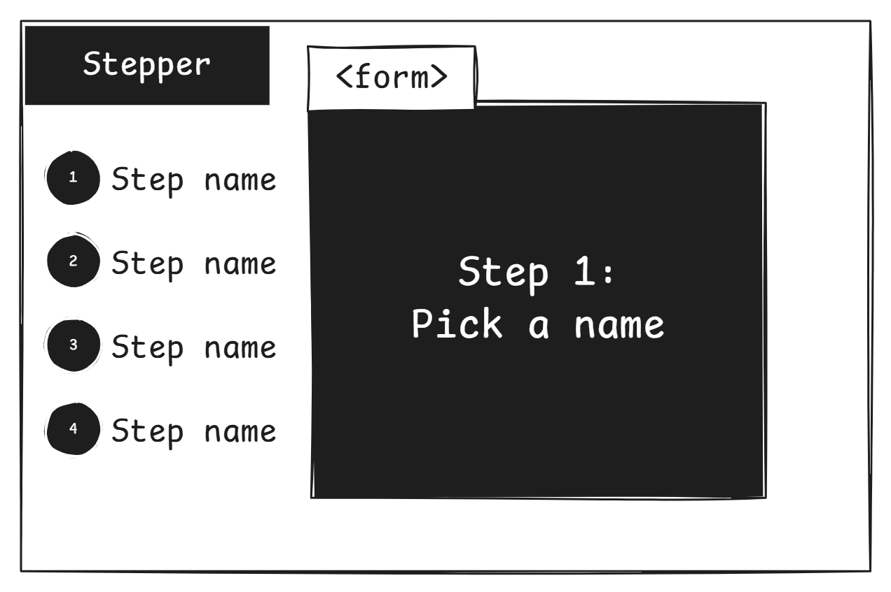

Each step is a `<form>` that calls an endpoint like `/form/step1` and swaps out itself with the returned form (which should be the `<form>` of the next step).

```html
templ Step1() {
	<form hx-post="/form/step1" hx-target="this" hx-swap="outerHTML">
		<fieldset class="fieldset mb-2">
			<legend class="fieldset-legend">Name of the instrument?</legend>
			<input type="text" name="name" class="input" placeholder="Ex: Piano" required/>
		</fieldset>
		<button class="btn btn-neutral">Submit</button>
	</form>
}
```

The backend then processes the data, and returns the next `<form>`:
```golang
func formStep1(w http.ResponseWriter, r *http.Request) (http.Handler, error) {
	name := strings.TrimSpace(r.FormValue("name"))
	if len(name) == 0 {
		return pox.Templ(http.StatusOK, templates.AlertError("Name cannot be empty")), nil
	}
	return pox.Templ(http.StatusOK, templates.Step2()), nil
}
```

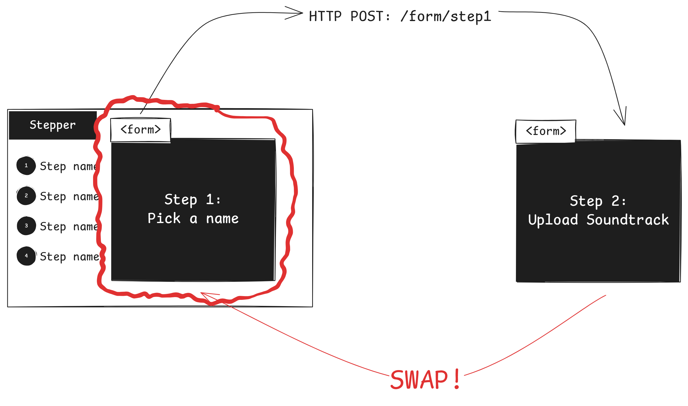

## What's wrong here?
Let's start with the obvious one. The step-labels on the left are not highlighted.


As we progress through this article, we'll face harder & harder problems as we bring this application to production-grade.

## Challenge 1: Highlight Current Step
_**Difficulty: easy**_
Obviously, swapping the `<form>` was not enough, we need to swap the entire `Stepper`!

**Or: If you had other elements in `Stepper` you didn't want to swap, then you'll need out-of-band swaps to swap just the left column (OOB are always a context nightmare)**

If your template language of choice allows you to embed children into a template, then you can break each step (`<form>`) into their own templates:
```html
templ Step1() {
	<form hx-post="/form/step1" hx-target="this" hx-swap="outerHTML">
		...
	</form>
}

templ Step2() {
	<form
		hx-post="/form/step2"
		hx-target="this"
		hx-swap="outerHTML"
		x-data
		x-ref="form"
		hx-encoding="multipart/form-data"
	>
		...
	</form>
}

templ Step3() {
	<form hx-post="/form/step3" hx-target="this" hx-swap="outerHTML">
		...
	</form>
}

templ Step4() {
	<form>
		...
	</form>
}
```

Then render the initial page with `Step1` as the child of the Stepper template:
```html
templ Home() {
	<!DOCTYPE html>
	<html lang="en">
		<head>
			...
		</head>
		<body>
			@header()
			@Stepper(1, Step1())
		</body>
	</html>
}

var steps = []step{
	{name: "Choose Name", number: 1},
	{name: "Upload File", number: 2},
	{name: "Upload Markers", number: 3},
	{name: "Review", number: 4},
}

templ Stepper(currentStep int, child templ.Component) {
	<div class="container flex mx-auto px-4" id="stepper">
		<ul class="steps steps-vertical">
			for _, step := range steps {
				<li class={ map[string]bool{"step": true, "step-primary": currentStep >= step.number} }>
					{ step.name }
				</li>
			}
		</ul>
		<div class="flex-1 p-4">
			@child
		</div>
	</div>
}
```

Let's see what we have so far:

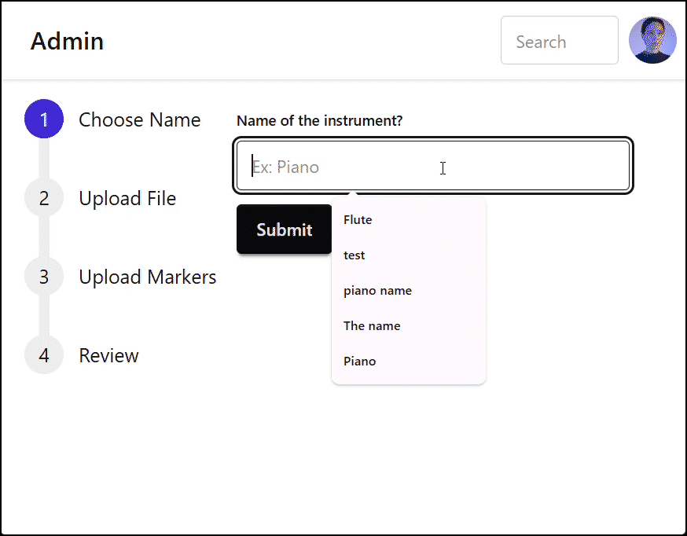

Interesting? It seems we're losing the entire left column! Some of you already know why, but for those that don't, how can we debug this?

The most basic tool of all, "Inspect"!


Admittedly, it's a little hard to follow. But if you look closely, you can see that `<div id="stepper"></div>` gets replaced with just a `<form>`.

To illustrate:

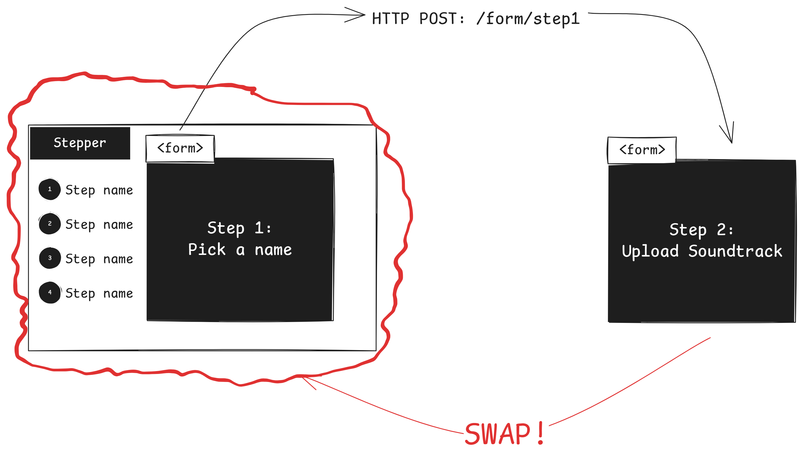

That's because our backend endpoints only returns a `<form>`, and that swaps the entire `#stepper`. Let's make a change so each endpoint returns a new stepper:

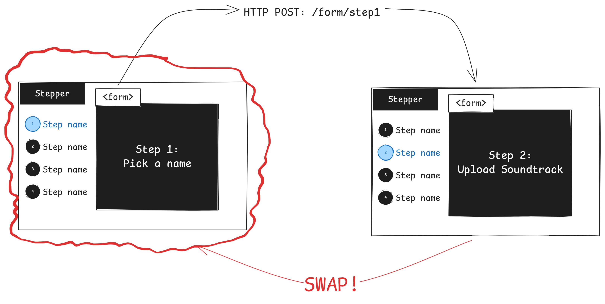

```go
func formStep1(w http.ResponseWriter, r *http.Request) (http.Handler, error) {
	// ...
//	return pox.Templ(http.StatusOK, templates.Step2()), nil
	return pox.Templ(http.StatusOK, templates.Stepper(2, templates.Step2())), nil
}

func formStep2(w http.ResponseWriter, r *http.Request) (http.Handler, error) {
	// ...
//	return pox.Templ(http.StatusOK, templates.Step3()), nil
	return pox.Templ(http.StatusOK, templates.Stepper(3, templates.Step3())), nil
}

func formStep3(w http.ResponseWriter, r *http.Request) (http.Handler, error) {
//	return pox.Templ(http.StatusOK, templates.Step4()), nil
	return pox.Templ(http.StatusOK, templates.Stepper(4, templates.Step4())), nil
}
```

As a result, we've completed the first challenge:


> Lesson learned: sometimes you need to make the unintuitive choice of replacing the entire parent to swap out a child.

## Challenge 2: Passing data down each step
Difficult: Intermediate

You may have noticed at the beginning of the article, the name I wrote in Step 1 didn't match the name in `Step 4 (Review)`.

Because it's all dummy data!

Fortunately, sending data to the server with HTMX is easy. State management on the other hand? That's a little harder.

How do you pass data from one step to the other?

There's several approaches that can integrate with our existing workflow:

- Approach #1: each step/endpoint returns the next `<form>`, with a hidden `<input>` containing all the data from the previous steps.

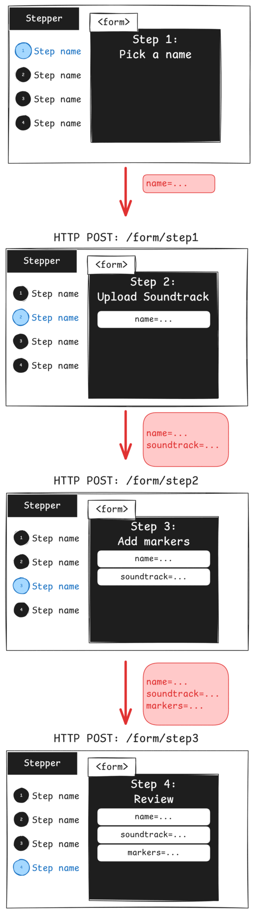

This approach of passing down a copy of the data has a couple downsides. For one, you need to revalidate ALL OF THE DATA with each step.

Second, it's "just ain't it y'know".

- Approach #2: create a temporary server-side long-lived `form session`, that is attached to the user's session via an ID.

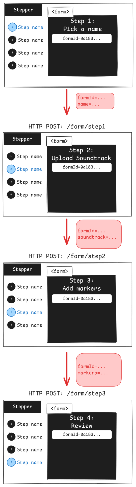

We'll use approach #2.

So let's split this up in several steps:

1. The user opens `/form`

	1.1: A `FormSession` is generated server-side with a unique id
	1.2: Serve `Step1` to the user, with `FormSession.Id` sent in an invisible `<input>`
2. When the user submits `Step1`:
	2.1: HTTP POST `/form/step1`
	2.2: the server validates the data, and saves it to the associated FormSession (via the id).
	2.3: the server serves `Step2` (with another invisible `<input>` having the id)
3. Repeat #2 for the rest of the steps
4. Profit

We're using Golang for this application, but this is applicable to any language.

Also note that we're using in-memory storage, in addition to no safety measures at all (no mutex or such), as the focus of this article is on HTMX, not production grade systems (**YET!**).

TLDR: Copy my ideas, not my implementation!

### Step 1: Serve initial page with `FormSession`
Here's where we're at:
```go
func home(w http.ResponseWriter, r *http.Request) (http.Handler, error) {
	return pox.Templ(http.StatusOK, templates.Home()), nil
}
```

Let's create a unique form session, and send it to the user:
```go
type FormSession struct {
	Id         string
	Name       string
	Soundtrack string
	Markers    []Marker
}

type Marker struct {
	Name  string
	Start time.Duration
}

var sessions = map[string]*FormSession{}

func home(w http.ResponseWriter, r *http.Request) (http.Handler, error) {
	// In production-grade systems, you'll might save this into a Database
	sessionId := uuid.NewString()
	// In real code, don't write to `sessions` without mutex
	sessions[sessionId] = &FormSession{Id: sessionId}
	return pox.Templ(http.StatusOK, templates.Home(sessionId)), nil
}
```

Our `Home` template passes `sessionId` to `Step1`:
```html
templ Home(sessionId string) {
	<!DOCTYPE html>
	<html lang="en">
		<head>
			...
		</head>
		<body>
			@header()
			@Stepper(1, Step1(sessionId))
		</body>
	</html>
}

templ Stepper(currentStep int, child templ.Component) {
	<div ...>
		<!-- Render `child` -->
		@child
	</div>
}

templ Step1(sessionId string) {
	<form hx-post="/form/step1" hx-target="#stepper" hx-swap="outerHTML">
		<!-- This invisible input is where the magic is -->
		<input type="hidden" name="sessionId" value={ sessionId }/>
		
		<fieldset class="fieldset mb-2">
			...
		</fieldset>
		<button class="btn btn-neutral">Submit</button>
	</form>
}
```

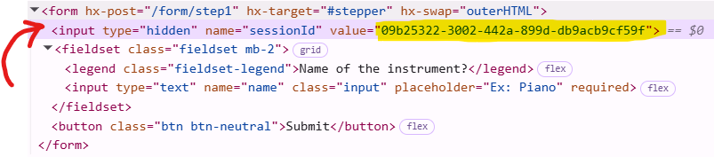

After submitting the first step of the form, you'll notice the `sessionId` sent along with the name:

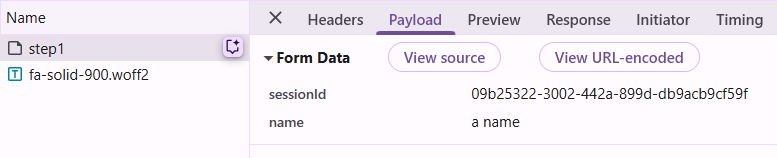

### Step 2: Mutate session on server, then send the next `<form>`
Right now, `/form/step1` simply reads the name, does nothing with it, and sends the next form:
```go
func formStep1(w http.ResponseWriter, r *http.Request) (http.Handler, error) {
	name := strings.TrimSpace(r.FormValue("name"))
	if len(name) == 0 {
		return pox.Templ(http.StatusOK, templates.AlertError("Name cannot be empty")), nil
	}
	return pox.Templ(http.StatusOK, templates.Stepper(2, templates.Step2())), nil
}
```

Let's read the `sessionId`, mutate the associated session, then send the `<form>` along with that same `sessionId`.

```go
func formStep1(w http.ResponseWriter, r *http.Request) (http.Handler, error) {
	name := strings.TrimSpace(r.FormValue("name"))
	if len(name) == 0 {
		return pox.Templ(http.StatusOK, templates.AlertError("Name cannot be empty")), nil
	}

	sessionId := r.FormValue("sessionId")
	// In real code, protect with a mutex!
	// WARNING! ENSURE `sessionId` EXISTS IN `sessions`, OTHERWISE YOUR SERVER WILL PANIC AND CRASH!!!
	sessions[sessionId].Name = name

	return pox.Templ(http.StatusOK, templates.Stepper(2, templates.Step2(sessionId))), nil
}
```

### Step 2.1: quick challenge, display the name chosen in Step 1 inside Step 2
When learning, it's good to make little milestones that, upon completion, give a sense of progress and achievement.

How can we achieve this?

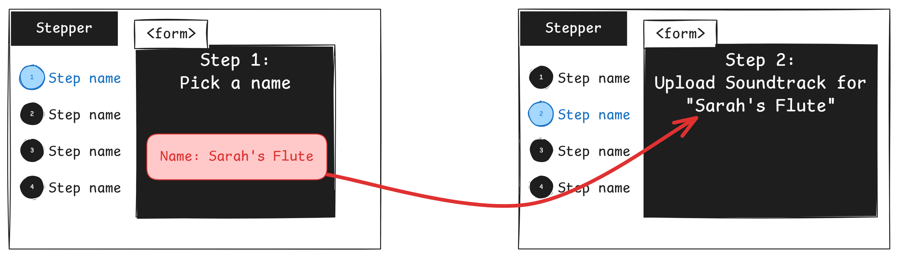

Turns out to be incredibly easy actually!

Let's make the `Step2` template take a `name`, and then display it:
```html
templ Step2(sessionId string, name string) {
	<form ...>
		<p class="mb-2">Upload an audio file for <b>"{ name }"</b> (ex: mp3, wav, opus, etc)</p>
		...
	</form>
}
```

Then pass the name into the template from the backend route:
```go
func formStep1(w http.ResponseWriter, r *http.Request) (http.Handler, error) {
	name := strings.TrimSpace(r.FormValue("name"))
	//...

	sessionId := r.FormValue("sessionId")
	sessions[sessionId].Name = name

	// Passing `name` over here
	return pox.Templ(http.StatusOK, templates.Stepper(2, templates.Step2(sessionId, name))), nil
}
```


### Step 3: (rapid fire) mutate session, give it to the next one
Most of the following will be rather tedious, so skip if you think you already got it.

Inside [Step 2's template], put invisible `input`:
```html
templ Step2(sessionId string, name string) {
	<form ...>
		<input type="hidden" name="sessionId" value={ sessionId }/>
		...
	</form>
}
```

Inside [Step 2's backend handler], we do a fake s3 upload and mutate the session:
```go
func formStep2(w http.ResponseWriter, r *http.Request) (http.Handler, error) {
	file, headers, err := r.FormFile("file")
	if err != nil {
		return pox.Templ(http.StatusOK, templates.AlertError("Cannot open file, please contact tech support!")), fmt.Errorf("r.FormFile: %w", err)
	}

	// In real code, avoid using `headers.Filename` (or at least with safety precautions)
	uploadUrl, err := FakeS3Upload(headers.Filename, file)
	if err != nil {
		return pox.Templ(http.StatusOK, templates.AlertError("Cannot upload file, try again")), fmt.Errorf("FakeS3Upload: %w", err)
	}

	sessionId := r.FormValue("sessionId")
	sessions[sessionId].Soundtrack = uploadUrl

	// Let's log the data we have so far
	litter.Dump(sessions[sessionId])

	// Don't forget to pass `sessionId` to next step
	return pox.Templ(http.StatusOK, templates.Stepper(3, templates.Step3(sessionId))), nil
}
```

Again in [Step 3 Template]
```html
templ Step3(sessionId string) {
	<form hx-post="/form/step3" hx-target="#stepper" hx-swap="outerHTML">
		<input type="hidden" name="sessionId" value={ sessionId }/>
		...
		<button class="btn btn-neutral">Submit</button>
	</form>
}
```

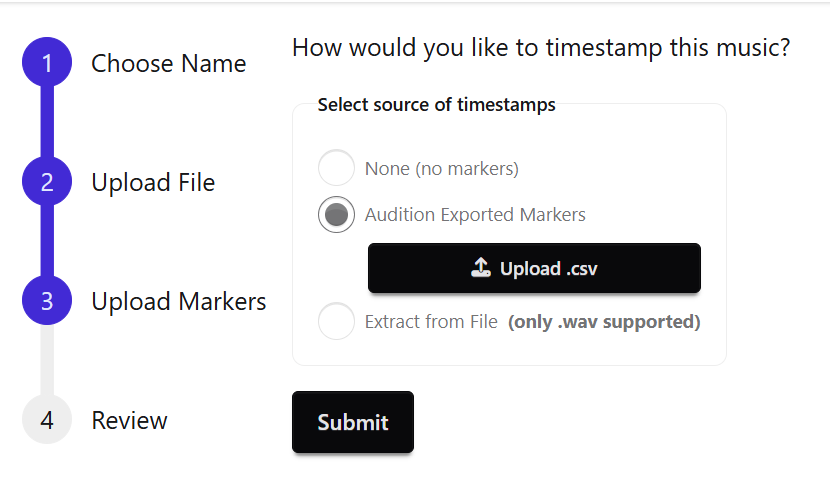

Step 3 is a little unique in that we might upload a file if a certain method is picked. (As a matter of fact, it'll be its own challenge in the next blog post!)

For now, we'll just assign an empty array to the `FormSession`

[Step 3's Backend Handler]:
```go
func formStep3(w http.ResponseWriter, r *http.Request) (http.Handler, error) {
	sessionId := r.FormValue("sessionId")
	session := sessions[sessionId]
	session.Markers = []Marker{}

	return pox.Templ(http.StatusOK, templates.Stepper(4,
		// This time we pass extra information, as this is the review step
		// Markers are TODO
		templates.Step4(sessionId, session.Name, session.Soundtrack),
	)), nil
}
```

Finally, [Step 4 Template]:
```go
templ Step4(sessionId string, name string, soundtrackUrl string) {
	<form>
		<input type="hidden" name="sessionId" value={ sessionId }/>
		<p class="mb-4">Review all information</p>
		<hr class="mb-4"/>
		<p class="mb-4">Name: <b>{ name }</b></p>
		<p class="mb-4 flex gap-2 items-center">
			Audio:
			<audio src={ soundtrackUrl } controls></audio>
		</p>
		<table class="table table-zebra mb-4">
			...
		</table>
		<button class="btn btn-neutral">Submit</button>
	</form>
}
```

Step 4 doesn't have its own backend handler yet.

## Conclusion
It turns out this blog post ended up being WAY LONGER than I originally hoped. And we haven't even made it to the "HARD" parts (per the title).

I promise though, we'll be solving the real problems in the next continuation of the article.

So far though, we've managed to create a multi-step form in HTMX, and save the data from each step in the server.

The next challenges in the continuation will be architecturally focused (and less about the code).

## Need help? Get in contact
I'm reachable through the comments on this blog, or at my email bookofcooks123@gmail.com. I'm willing to help answer questions and such anytime.

You might also find me on the FlutterDev and HTMX discords.

I'm also open to job opportunities, y'know if you need someone with expertise in Flutter, Golang, SvelteKit, and/or HTMX ;D
